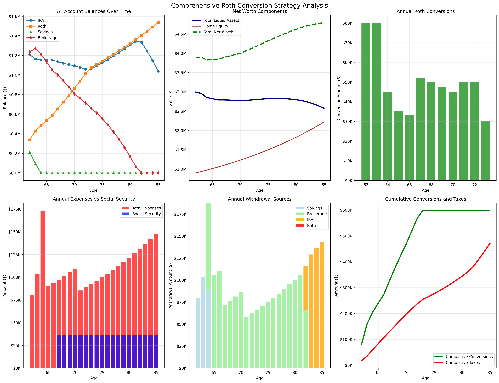

## Execution command: `uv run python src/retirement_analysis/main.py`

Economic assumptions:
 - 3% market return
 - 4% inflation

```
🎯 ROTH CONVERSION STRATEGY ANALYSIS
============================================================
Retirement: 2026-2049 (ages 62-85)
Social Security: $36,000/year starting at age 67
Target: Maximize Roth balance while preserving it for inheritance
============================================================

--- Year 2026 (Age 62) ---
After growth: IRA=$1,287,500, Roth=$257,500
              Savings=$309,000, Brokerage=$1,236,000
Expenses: $80,000, SS: $0, Net need: $80,000

🔄 Evaluating Roth conversion at age 62
Target conversion: $80,000
Tax needed: $17,600
Available for tax: $927,000
✅ CONVERTED: $80,000 (tax: $17,600)

💰 Covering expenses: $80,000
Used savings: $80,000, remaining need: $0
End balances: IRA=$1,207,500, Roth=$337,500
              Savings=$211,400, Brokerage=$1,236,000

--- Year 2027 (Age 63) ---
After growth: IRA=$1,243,725, Roth=$347,625
              Savings=$217,742, Brokerage=$1,273,080
Expenses: $104,000, SS: $0, Net need: $104,000

🔄 Evaluating Roth conversion at age 63
Target conversion: $80,000
Tax needed: $17,600
Available for tax: $854,282
✅ CONVERTED: $80,000 (tax: $17,600)

💰 Covering expenses: $104,000
Used savings: $104,000, remaining need: $0
End balances: IRA=$1,163,725, Roth=$427,625
              Savings=$96,142, Brokerage=$1,273,080

--- Year 2028 (Age 64) ---
After growth: IRA=$1,198,637, Roth=$440,454
              Savings=$99,026, Brokerage=$1,311,272
Expenses: $173,056, SS: $0, Net need: $173,056

🔄 Evaluating Roth conversion at age 64
Target conversion: $44,803
Tax needed: $9,857
Available for tax: $754,662
✅ CONVERTED: $44,803 (tax: $9,857)

💰 Covering expenses: $173,056
Used savings: $89,170, remaining need: $83,886
Used brokerage: $98,690 (net: $83,886), remaining need: $0
End balances: IRA=$1,153,834, Roth=$485,257
              Savings=$0, Brokerage=$1,212,582

--- Year 2029 (Age 65) ---
After growth: IRA=$1,188,449, Roth=$499,815
              Savings=$0, Brokerage=$1,248,960
Expenses: $89,989, SS: $0, Net need: $89,989

🔄 Evaluating Roth conversion at age 65
Target conversion: $35,415
Tax needed: $7,791
Available for tax: $624,480
✅ CONVERTED: $35,415 (tax: $7,791)

💰 Covering expenses: $89,989
Used brokerage: $105,870 (net: $89,989), remaining need: $0
End balances: IRA=$1,153,033, Roth=$535,230
              Savings=$0, Brokerage=$1,135,299

--- Year 2030 (Age 66) ---
After growth: IRA=$1,187,624, Roth=$551,287
              Savings=$0, Brokerage=$1,169,358
Expenses: $93,589, SS: $0, Net need: $93,589

🔄 Evaluating Roth conversion at age 66
Target conversion: $33,298
Tax needed: $7,326
Available for tax: $584,679
✅ CONVERTED: $33,298 (tax: $7,326)

💰 Covering expenses: $93,589
Used brokerage: $110,104 (net: $93,589), remaining need: $0
End balances: IRA=$1,154,327, Roth=$584,584
              Savings=$0, Brokerage=$1,051,928

--- Year 2031 (Age 67) ---
After growth: IRA=$1,188,956, Roth=$602,122
              Savings=$0, Brokerage=$1,083,486
Expenses: $97,332, SS: $36,000, Net need: $61,332

🔄 Evaluating Roth conversion at age 67
Target conversion: $52,272
Tax needed: $11,500
Available for tax: $541,743
✅ CONVERTED: $52,272 (tax: $11,500)

💰 Covering expenses: $61,332
Used brokerage: $72,156 (net: $61,332), remaining need: $-0
End balances: IRA=$1,136,684, Roth=$654,394
              Savings=$0, Brokerage=$999,831

--- Year 2032 (Age 68) ---
After growth: IRA=$1,170,785, Roth=$674,026
              Savings=$0, Brokerage=$1,029,825
Expenses: $101,226, SS: $36,000, Net need: $65,226

🔄 Evaluating Roth conversion at age 68
Target conversion: $49,982
Tax needed: $10,996
Available for tax: $514,913
✅ CONVERTED: $49,982 (tax: $10,996)

💰 Covering expenses: $65,226
Used brokerage: $76,736 (net: $65,226), remaining need: $0
End balances: IRA=$1,120,803, Roth=$724,008
              Savings=$0, Brokerage=$942,094

--- Year 2033 (Age 69) ---
After growth: IRA=$1,154,427, Roth=$745,728
              Savings=$0, Brokerage=$970,356
Expenses: $105,275, SS: $36,000, Net need: $69,275

🔄 Evaluating Roth conversion at age 69
Target conversion: $47,600
Tax needed: $10,472
Available for tax: $485,178
✅ CONVERTED: $47,600 (tax: $10,472)

💰 Covering expenses: $69,275
Used brokerage: $81,499 (net: $69,275), remaining need: $0
End balances: IRA=$1,106,826, Roth=$793,329
              Savings=$0, Brokerage=$878,385

--- Year 2034 (Age 70) ---
After growth: IRA=$1,140,031, Roth=$817,128
              Savings=$0, Brokerage=$904,736
Expenses: $109,486, SS: $36,000, Net need: $73,486

🔄 Evaluating Roth conversion at age 70
Target conversion: $45,123
Tax needed: $9,927
Available for tax: $452,368
✅ CONVERTED: $45,123 (tax: $9,927)

💰 Covering expenses: $73,486
Used brokerage: $86,454 (net: $73,486), remaining need: $0
End balances: IRA=$1,094,908, Roth=$862,252
              Savings=$0, Brokerage=$808,356

--- Year 2035 (Age 71) ---
After growth: IRA=$1,127,755, Roth=$888,119
              Savings=$0, Brokerage=$832,606
Expenses: $85,399, SS: $36,000, Net need: $49,399

🔄 Evaluating Roth conversion at age 71
Target conversion: $50,000
Tax needed: $11,000
Available for tax: $416,303
✅ CONVERTED: $50,000 (tax: $11,000)

💰 Covering expenses: $49,399
Used brokerage: $58,116 (net: $49,399), remaining need: $0
End balances: IRA=$1,077,755, Roth=$938,119
              Savings=$0, Brokerage=$763,490

--- Year 2036 (Age 72) ---
After growth: IRA=$1,110,088, Roth=$966,263
              Savings=$0, Brokerage=$786,395
Expenses: $88,815, SS: $36,000, Net need: $52,815

🔄 Evaluating Roth conversion at age 72
Target conversion: $50,000
Tax needed: $11,000
Available for tax: $393,197
✅ CONVERTED: $50,000 (tax: $11,000)

💰 Covering expenses: $52,815
Used brokerage: $62,135 (net: $52,815), remaining need: $0
End balances: IRA=$1,060,088, Roth=$1,016,263
              Savings=$0, Brokerage=$713,260

--- Year 2037 (Age 73) ---
After growth: IRA=$1,091,891, Roth=$1,046,751
              Savings=$0, Brokerage=$734,658
Expenses: $92,367, SS: $36,000, Net need: $56,367

🔄 Evaluating Roth conversion at age 73
Target conversion: $30,000
Tax needed: $6,600
Available for tax: $367,329
✅ CONVERTED: $30,000 (tax: $6,600)

💰 Covering expenses: $56,367
Used brokerage: $66,314 (net: $56,367), remaining need: $0
End balances: IRA=$1,061,891, Roth=$1,076,751
              Savings=$0, Brokerage=$661,743

--- Year 2038 (Age 74) ---
After growth: IRA=$1,093,747, Roth=$1,109,053
              Savings=$0, Brokerage=$681,596
Expenses: $96,062, SS: $36,000, Net need: $60,062

💰 Covering expenses: $60,062
Used brokerage: $70,661 (net: $60,062), remaining need: $0
End balances: IRA=$1,093,747, Roth=$1,109,053
              Savings=$0, Brokerage=$610,935

--- Year 2039 (Age 75) ---
After growth: IRA=$1,126,560, Roth=$1,142,325
              Savings=$0, Brokerage=$629,263
Expenses: $99,904, SS: $36,000, Net need: $63,904

💰 Covering expenses: $63,904
Used brokerage: $75,182 (net: $63,904), remaining need: $0
End balances: IRA=$1,126,560, Roth=$1,142,325
              Savings=$0, Brokerage=$554,081

--- Year 2040 (Age 76) ---
After growth: IRA=$1,160,357, Roth=$1,176,595
              Savings=$0, Brokerage=$570,703
Expenses: $103,901, SS: $36,000, Net need: $67,901

💰 Covering expenses: $67,901
Used brokerage: $79,883 (net: $67,901), remaining need: $0
End balances: IRA=$1,160,357, Roth=$1,176,595
              Savings=$0, Brokerage=$490,820

--- Year 2041 (Age 77) ---
After growth: IRA=$1,195,167, Roth=$1,211,892
              Savings=$0, Brokerage=$505,545
Expenses: $108,057, SS: $36,000, Net need: $72,057

💰 Covering expenses: $72,057
Used brokerage: $84,772 (net: $72,057), remaining need: $0
End balances: IRA=$1,195,167, Roth=$1,211,892
              Savings=$0, Brokerage=$420,773

--- Year 2042 (Age 78) ---
After growth: IRA=$1,231,022, Roth=$1,248,249
              Savings=$0, Brokerage=$433,396
Expenses: $112,379, SS: $36,000, Net need: $76,379

💰 Covering expenses: $76,379
Used brokerage: $89,857 (net: $76,379), remaining need: $0
End balances: IRA=$1,231,022, Roth=$1,248,249
              Savings=$0, Brokerage=$343,538

--- Year 2043 (Age 79) ---
After growth: IRA=$1,267,953, Roth=$1,285,697
              Savings=$0, Brokerage=$353,844
Expenses: $116,874, SS: $36,000, Net need: $80,874

💰 Covering expenses: $80,874
Used brokerage: $95,146 (net: $80,874), remaining need: $0
End balances: IRA=$1,267,953, Roth=$1,285,697
              Savings=$0, Brokerage=$258,698

--- Year 2044 (Age 80) ---
After growth: IRA=$1,305,991, Roth=$1,324,268
              Savings=$0, Brokerage=$266,459
Expenses: $121,549, SS: $36,000, Net need: $85,549

💰 Covering expenses: $85,549
Used brokerage: $100,646 (net: $85,549), remaining need: $0
End balances: IRA=$1,305,991, Roth=$1,324,268
              Savings=$0, Brokerage=$165,814

--- Year 2045 (Age 81) ---
After growth: IRA=$1,345,171, Roth=$1,363,996
              Savings=$0, Brokerage=$170,788
Expenses: $126,411, SS: $36,000, Net need: $90,411

💰 Covering expenses: $90,411
Used brokerage: $106,366 (net: $90,411), remaining need: $0
End balances: IRA=$1,345,171, Roth=$1,363,996
              Savings=$0, Brokerage=$64,422

--- Year 2046 (Age 82) ---
After growth: IRA=$1,385,526, Roth=$1,404,915
              Savings=$0, Brokerage=$66,355
Expenses: $131,467, SS: $36,000, Net need: $95,467

💰 Covering expenses: $95,467
Used brokerage: $66,355 (net: $56,402), remaining need: $39,066
Used IRA: $50,084 (net: $39,066), remaining need: $0
End balances: IRA=$1,335,442, Roth=$1,404,915
              Savings=$0, Brokerage=$0

--- Year 2047 (Age 83) ---
After growth: IRA=$1,375,505, Roth=$1,447,063
              Savings=$0, Brokerage=$0
Expenses: $136,726, SS: $36,000, Net need: $100,726

💰 Covering expenses: $100,726
Used IRA: $129,136 (net: $100,726), remaining need: $0
End balances: IRA=$1,246,369, Roth=$1,447,063
              Savings=$0, Brokerage=$0

--- Year 2048 (Age 84) ---
After growth: IRA=$1,283,760, Roth=$1,490,475
              Savings=$0, Brokerage=$0
Expenses: $142,195, SS: $36,000, Net need: $106,195

💰 Covering expenses: $106,195
Used IRA: $136,148 (net: $106,195), remaining need: $0
🚨 SHORTFALL: $0 - REFUSING to use Roth!
End balances: IRA=$1,147,613, Roth=$1,490,475
              Savings=$0, Brokerage=$0

--- Year 2049 (Age 85) ---
After growth: IRA=$1,182,041, Roth=$1,535,189
              Savings=$0, Brokerage=$0
Expenses: $147,883, SS: $36,000, Net need: $111,883

💰 Covering expenses: $111,883
Used IRA: $143,440 (net: $111,883), remaining need: $0
End balances: IRA=$1,038,601, Roth=$1,535,189
              Savings=$0, Brokerage=$0

🎯 STRATEGY RESULTS
==================================================
Total Roth conversions: $598,494
Total taxes paid: $470,648
Total Roth withdrawals: $0
Roth preserved for inheritance: YES

📊 FINAL ACCOUNT BALANCES AT AGE 85:
IRA Balance: $1,038,601
Roth Balance: $1,535,189
Savings Balance: $0
Brokerage Balance: $0
Home Equity (with appreciation): $2,218,244
------------------------------
Total Liquid Assets: $2,573,791
NET WORTH AT 85: $4,792,035

💰 WEALTH ANALYSIS:
Initial liquid assets: $3,000,000
Asset growth despite distributions: $-426,209
Tax-free inheritance (Roth): $1,535,189

Visualization saved to: output/roth_conversion_analysis.png

📈 NET WORTH PROGRESSION SUMMARY
======================================================================
Age  Year   IRA          Roth         Savings      Brokerage    Home_Equity     Net_Worth
------------------------------------------------------------------------------------------
62   2026   $1,207,500   $337,500     $211,400     $1,236,000   $900,000        $3,892,400
67   2031   $1,136,684   $654,394     $0           $999,831     $1,094,988      $3,885,897
72   2036   $1,060,088   $1,016,263   $0           $713,260     $1,332,220      $4,121,831
77   2041   $1,195,167   $1,211,892   $0           $420,773     $1,620,849      $4,448,681
82   2046   $1,335,442   $1,404,915   $0           $0           $1,972,011      $4,712,368
85   2049   $1,038,601   $1,535,189   $0           $0           $2,218,244      $4,792,035

💎 LEGACY ANALYSIS AT AGE 85:
Tax-Deferred Assets (IRA): $1,038,601
Tax-Free Assets (Roth): $1,535,189
Taxable Assets (Savings + Brokerage): $0
Real Estate (Home): $2,218,244
TOTAL NET WORTH: $4,792,035

Tax-free inheritance percentage: 32.0%
Detailed results saved to: output/roth_conversion_detailed_results.csv
Strategy summary saved to: output/strategy_summary.csv
```

## Summary Graphs



## CSV
