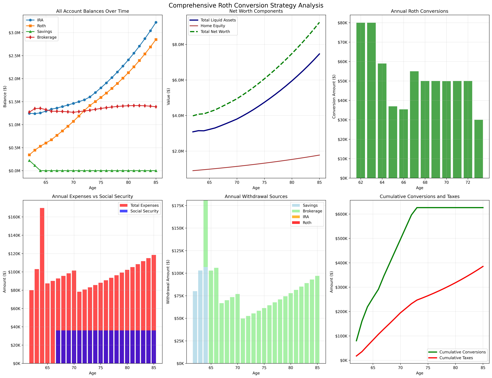

## Execution command: `uv run python src/retirement_analysis/main.py`

Economic assumptions:
 - 6% market return
 - 3% inflation

```
🎯 ROTH CONVERSION STRATEGY ANALYSIS
============================================================
Retirement: 2026-2049 (ages 62-85)
Social Security: $36,000/year starting at age 67
Target: Maximize Roth balance while preserving it for inheritance
============================================================

--- Year 2026 (Age 62) ---
After growth: IRA=$1,325,000, Roth=$265,000
              Savings=$318,000, Brokerage=$1,272,000
Expenses: $80,000, SS: $0, Net need: $80,000

🔄 Evaluating Roth conversion at age 62
Target conversion: $80,000
Tax needed: $17,600
Available for tax: $954,000
✅ CONVERTED: $80,000 (tax: $17,600)

💰 Covering expenses: $80,000
Used savings: $80,000, remaining need: $0
End balances: IRA=$1,245,000, Roth=$345,000
              Savings=$220,400, Brokerage=$1,272,000

--- Year 2027 (Age 63) ---
After growth: IRA=$1,319,700, Roth=$365,700
              Savings=$233,624, Brokerage=$1,348,320
Expenses: $103,000, SS: $0, Net need: $103,000

🔄 Evaluating Roth conversion at age 63
Target conversion: $80,000
Tax needed: $17,600
Available for tax: $907,784
✅ CONVERTED: $80,000 (tax: $17,600)

💰 Covering expenses: $103,000
Used savings: $103,000, remaining need: $0
End balances: IRA=$1,239,700, Roth=$445,700
              Savings=$113,024, Brokerage=$1,348,320

--- Year 2028 (Age 64) ---
After growth: IRA=$1,314,082, Roth=$472,442
              Savings=$119,805, Brokerage=$1,429,219
Expenses: $169,744, SS: $0, Net need: $169,744

🔄 Evaluating Roth conversion at age 64
Target conversion: $58,974
Tax needed: $12,974
Available for tax: $834,415
✅ CONVERTED: $58,974 (tax: $12,974)

💰 Covering expenses: $169,744
Used savings: $106,831, remaining need: $62,913
Used brokerage: $74,015 (net: $62,913), remaining need: $0
End balances: IRA=$1,255,108, Roth=$531,416
              Savings=$0, Brokerage=$1,355,204

--- Year 2029 (Age 65) ---
After growth: IRA=$1,330,414, Roth=$563,301
              Savings=$0, Brokerage=$1,436,516
Expenses: $87,418, SS: $0, Net need: $87,418

🔄 Evaluating Roth conversion at age 65
Target conversion: $36,928
Tax needed: $8,124
Available for tax: $718,258
✅ CONVERTED: $36,928 (tax: $8,124)

💰 Covering expenses: $87,418
Used brokerage: $102,845 (net: $87,418), remaining need: $0
End balances: IRA=$1,293,487, Roth=$600,229
              Savings=$0, Brokerage=$1,325,547

--- Year 2030 (Age 66) ---
After growth: IRA=$1,371,096, Roth=$636,243
              Savings=$0, Brokerage=$1,405,080
Expenses: $90,041, SS: $0, Net need: $90,041

🔄 Evaluating Roth conversion at age 66
Target conversion: $35,385
Tax needed: $7,785
Available for tax: $702,540
✅ CONVERTED: $35,385 (tax: $7,785)

💰 Covering expenses: $90,041
Used brokerage: $105,930 (net: $90,041), remaining need: $0
End balances: IRA=$1,335,711, Roth=$671,628
              Savings=$0, Brokerage=$1,291,365

--- Year 2031 (Age 67) ---
After growth: IRA=$1,415,853, Roth=$711,925
              Savings=$0, Brokerage=$1,368,847
Expenses: $92,742, SS: $36,000, Net need: $56,742

🔄 Evaluating Roth conversion at age 67
Target conversion: $54,972
Tax needed: $12,094
Available for tax: $684,424
✅ CONVERTED: $54,972 (tax: $12,094)

💰 Covering expenses: $56,742
Used brokerage: $66,755 (net: $56,742), remaining need: $0
End balances: IRA=$1,360,881, Roth=$766,898
              Savings=$0, Brokerage=$1,289,998

--- Year 2032 (Age 68) ---
After growth: IRA=$1,442,534, Roth=$812,911
              Savings=$0, Brokerage=$1,367,398
Expenses: $95,524, SS: $36,000, Net need: $59,524

🔄 Evaluating Roth conversion at age 68
Target conversion: $50,000
Tax needed: $11,000
Available for tax: $683,699
✅ CONVERTED: $50,000 (tax: $11,000)

💰 Covering expenses: $59,524
Used brokerage: $70,028 (net: $59,524), remaining need: $0
End balances: IRA=$1,392,534, Roth=$862,911
              Savings=$0, Brokerage=$1,286,369

--- Year 2033 (Age 69) ---
After growth: IRA=$1,476,086, Roth=$914,686
              Savings=$0, Brokerage=$1,363,552
Expenses: $98,390, SS: $36,000, Net need: $62,390

🔄 Evaluating Roth conversion at age 69
Target conversion: $50,000
Tax needed: $11,000
Available for tax: $681,776
✅ CONVERTED: $50,000 (tax: $11,000)

💰 Covering expenses: $62,390
Used brokerage: $73,400 (net: $62,390), remaining need: $0
Used IRA: $0 (net: $0), remaining need: $0
End balances: IRA=$1,426,086, Roth=$964,686
              Savings=$0, Brokerage=$1,279,152

--- Year 2034 (Age 70) ---
After growth: IRA=$1,511,651, Roth=$1,022,567
              Savings=$0, Brokerage=$1,355,901
Expenses: $101,342, SS: $36,000, Net need: $65,342

🔄 Evaluating Roth conversion at age 70
Target conversion: $49,914
Tax needed: $10,981
Available for tax: $677,950
✅ CONVERTED: $49,914 (tax: $10,981)

💰 Covering expenses: $65,342
Used brokerage: $76,872 (net: $65,342), remaining need: $-0
End balances: IRA=$1,461,737, Roth=$1,072,481
              Savings=$0, Brokerage=$1,268,047

--- Year 2035 (Age 71) ---
After growth: IRA=$1,549,442, Roth=$1,136,830
              Savings=$0, Brokerage=$1,344,130
Expenses: $78,286, SS: $36,000, Net need: $42,286

🔄 Evaluating Roth conversion at age 71
Target conversion: $50,000
Tax needed: $11,000
Available for tax: $672,065
✅ CONVERTED: $50,000 (tax: $11,000)

💰 Covering expenses: $42,286
Used brokerage: $49,749 (net: $42,286), remaining need: $0
End balances: IRA=$1,499,442, Roth=$1,186,830
              Savings=$0, Brokerage=$1,283,381

--- Year 2036 (Age 72) ---
After growth: IRA=$1,589,408, Roth=$1,258,040
              Savings=$0, Brokerage=$1,360,384
Expenses: $80,635, SS: $36,000, Net need: $44,635

🔄 Evaluating Roth conversion at age 72
Target conversion: $50,000
Tax needed: $11,000
Available for tax: $680,192
✅ CONVERTED: $50,000 (tax: $11,000)

💰 Covering expenses: $44,635
Used brokerage: $52,512 (net: $44,635), remaining need: $0
End balances: IRA=$1,539,408, Roth=$1,308,040
              Savings=$0, Brokerage=$1,296,873

--- Year 2037 (Age 73) ---
After growth: IRA=$1,631,773, Roth=$1,386,522
              Savings=$0, Brokerage=$1,374,685
Expenses: $83,054, SS: $36,000, Net need: $47,054

🔄 Evaluating Roth conversion at age 73
Target conversion: $30,000
Tax needed: $6,600
Available for tax: $687,342
✅ CONVERTED: $30,000 (tax: $6,600)

💰 Covering expenses: $47,054
Used brokerage: $55,358 (net: $47,054), remaining need: $0
End balances: IRA=$1,601,773, Roth=$1,416,522
              Savings=$0, Brokerage=$1,312,727

--- Year 2038 (Age 74) ---
After growth: IRA=$1,697,879, Roth=$1,501,513
              Savings=$0, Brokerage=$1,391,491
Expenses: $85,546, SS: $36,000, Net need: $49,546

💰 Covering expenses: $49,546
Used brokerage: $58,289 (net: $49,546), remaining need: $0
End balances: IRA=$1,697,879, Roth=$1,501,513
              Savings=$0, Brokerage=$1,333,202

--- Year 2039 (Age 75) ---
After growth: IRA=$1,799,752, Roth=$1,591,604
              Savings=$0, Brokerage=$1,413,194
Expenses: $88,112, SS: $36,000, Net need: $52,112

💰 Covering expenses: $52,112
Used brokerage: $61,308 (net: $52,112), remaining need: $0
End balances: IRA=$1,799,752, Roth=$1,591,604
              Savings=$0, Brokerage=$1,351,886

--- Year 2040 (Age 76) ---
After growth: IRA=$1,907,737, Roth=$1,687,100
              Savings=$0, Brokerage=$1,432,999
Expenses: $90,755, SS: $36,000, Net need: $54,755

💰 Covering expenses: $54,755
Used brokerage: $64,418 (net: $54,755), remaining need: $0
End balances: IRA=$1,907,737, Roth=$1,687,100
              Savings=$0, Brokerage=$1,368,581

--- Year 2041 (Age 77) ---
After growth: IRA=$2,022,201, Roth=$1,788,326
              Savings=$0, Brokerage=$1,450,696
Expenses: $93,478, SS: $36,000, Net need: $57,478

💰 Covering expenses: $57,478
Used brokerage: $67,621 (net: $57,478), remaining need: $-0
End balances: IRA=$2,022,201, Roth=$1,788,326
              Savings=$0, Brokerage=$1,383,074

--- Year 2042 (Age 78) ---
After growth: IRA=$2,143,533, Roth=$1,895,626
              Savings=$0, Brokerage=$1,466,059
Expenses: $96,282, SS: $36,000, Net need: $60,282

💰 Covering expenses: $60,282
Used brokerage: $70,920 (net: $60,282), remaining need: $0
End balances: IRA=$2,143,533, Roth=$1,895,626
              Savings=$0, Brokerage=$1,395,138

--- Year 2043 (Age 79) ---
After growth: IRA=$2,272,145, Roth=$2,009,364
              Savings=$0, Brokerage=$1,478,847
Expenses: $99,171, SS: $36,000, Net need: $63,171

💰 Covering expenses: $63,171
Used brokerage: $74,319 (net: $63,171), remaining need: $0
End balances: IRA=$2,272,145, Roth=$2,009,364
              Savings=$0, Brokerage=$1,404,528

--- Year 2044 (Age 80) ---
After growth: IRA=$2,408,474, Roth=$2,129,925
              Savings=$0, Brokerage=$1,488,800
Expenses: $102,146, SS: $36,000, Net need: $66,146

💰 Covering expenses: $66,146
Used brokerage: $77,819 (net: $66,146), remaining need: $0
End balances: IRA=$2,408,474, Roth=$2,129,925
              Savings=$0, Brokerage=$1,410,981

--- Year 2045 (Age 81) ---
After growth: IRA=$2,552,982, Roth=$2,257,721
              Savings=$0, Brokerage=$1,495,640
Expenses: $105,210, SS: $36,000, Net need: $69,210

💰 Covering expenses: $69,210
Used brokerage: $81,424 (net: $69,210), remaining need: $0
End balances: IRA=$2,552,982, Roth=$2,257,721
              Savings=$0, Brokerage=$1,414,216

--- Year 2046 (Age 82) ---
After growth: IRA=$2,706,161, Roth=$2,393,184
              Savings=$0, Brokerage=$1,499,069
Expenses: $108,367, SS: $36,000, Net need: $72,367

💰 Covering expenses: $72,367
Used brokerage: $85,137 (net: $72,367), remaining need: $0
End balances: IRA=$2,706,161, Roth=$2,393,184
              Savings=$0, Brokerage=$1,413,931

--- Year 2047 (Age 83) ---
After growth: IRA=$2,868,531, Roth=$2,536,775
              Savings=$0, Brokerage=$1,498,767
Expenses: $111,618, SS: $36,000, Net need: $75,618

💰 Covering expenses: $75,618
Used brokerage: $88,962 (net: $75,618), remaining need: $0
End balances: IRA=$2,868,531, Roth=$2,536,775
              Savings=$0, Brokerage=$1,409,805

--- Year 2048 (Age 84) ---
After growth: IRA=$3,040,643, Roth=$2,688,982
              Savings=$0, Brokerage=$1,494,394
Expenses: $114,966, SS: $36,000, Net need: $78,966

💰 Covering expenses: $78,966
Used brokerage: $92,901 (net: $78,966), remaining need: $0
End balances: IRA=$3,040,643, Roth=$2,688,982
              Savings=$0, Brokerage=$1,401,492

--- Year 2049 (Age 85) ---
After growth: IRA=$3,223,081, Roth=$2,850,321
              Savings=$0, Brokerage=$1,485,582
Expenses: $118,415, SS: $36,000, Net need: $82,415

💰 Covering expenses: $82,415
Used brokerage: $96,959 (net: $82,415), remaining need: $0
End balances: IRA=$3,223,081, Roth=$2,850,321
              Savings=$0, Brokerage=$1,388,623

🎯 STRATEGY RESULTS
==================================================
Total Roth conversions: $626,173
Total taxes paid: $384,889
Total Roth withdrawals: $0
Roth preserved for inheritance: YES

📊 FINAL ACCOUNT BALANCES AT AGE 85:
IRA Balance: $3,223,081
Roth Balance: $2,850,321
Savings Balance: $0
Brokerage Balance: $1,388,623
Home Equity (with appreciation): $1,776,228
------------------------------
Total Liquid Assets: $7,462,025
NET WORTH AT 85: $9,238,253

💰 WEALTH ANALYSIS:
Initial liquid assets: $3,000,000
Asset growth despite distributions: $4,462,025
Tax-free inheritance (Roth): $2,850,321

Visualization saved to: output/roth_conversion_analysis.png

📈 NET WORTH PROGRESSION SUMMARY
======================================================================
Age  Year   IRA          Roth         Savings      Brokerage    Home_Equity     Net_Worth
------------------------------------------------------------------------------------------
62   2026   $1,245,000   $345,000     $220,400     $1,272,000   $900,000        $3,982,400
67   2031   $1,360,881   $766,898     $0           $1,289,998   $1,043,347      $4,461,123
72   2036   $1,539,408   $1,308,040   $0           $1,296,873   $1,209,525      $5,353,845
77   2041   $2,022,201   $1,788,326   $0           $1,383,074   $1,402,171      $6,595,773
82   2046   $2,706,161   $2,393,184   $0           $1,413,931   $1,625,500      $8,138,777
85   2049   $3,223,081   $2,850,321   $0           $1,388,623   $1,776,228      $9,238,253

💎 LEGACY ANALYSIS AT AGE 85:
Tax-Deferred Assets (IRA): $3,223,081
Tax-Free Assets (Roth): $2,850,321
Taxable Assets (Savings + Brokerage): $1,388,623
Real Estate (Home): $1,776,228
TOTAL NET WORTH: $9,238,253

Tax-free inheritance percentage: 30.9%
Detailed results saved to: output/roth_conversion_detailed_results.csv
Strategy summary saved to: output/strategy_summary.csv`
```

## Summary Graphs



## CSV
